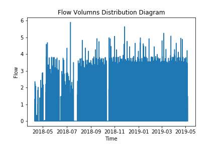
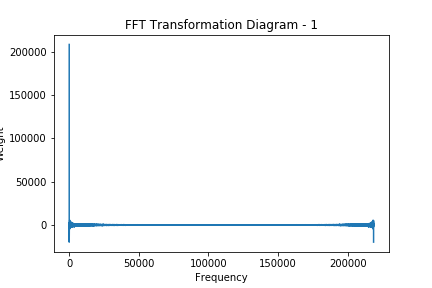
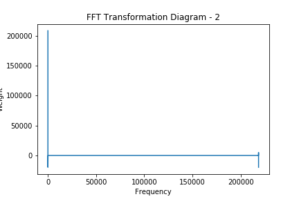
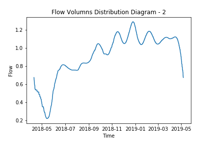

<h2 align="center">科研实训第十六周周报</h2>

<h4 align="center">数据科学与计算机学院 梁俊华</h4>

&nbsp;&nbsp;&nbsp;&nbsp;&nbsp;&nbsp;&nbsp;&nbsp;本周科研实训的任务主要是依据老师的方法，利用快速傅里叶变换将用水量的时序信号进行相关处理，得到其频域信号，然后设计一个简单的过滤器进行过滤处理，再通过逆傅里叶变换，将频域信号重新转换回时域信号，从而将原来陡峭，无规律的曲线光滑化。这部分的内容使用python来实现，主要用到python本身的fft和ifft方法进行傅里叶变换和逆傅里叶变换，并将最后的结果进行相应的对比。

&nbsp;&nbsp;&nbsp;&nbsp;&nbsp;&nbsp;&nbsp;&nbsp;首先数据的预处理与上次的有所不同，因为已经知道本次实验只需要用到数据集中的时间$Time$和流量$Flow$，因此只需要取出上述数据即可，不需要额外的操作，取出数据以后首先显示出两者之间的关系图像，如下图所示：

&nbsp;&nbsp;&nbsp;&nbsp;&nbsp;&nbsp;&nbsp;&nbsp;上图可以看出，曲线显得非常密集而且不连续，对于预测用水量高峰期到来是非常不方便的，因此我们的思路是，将这段时域信号转换为频域，然后经过人工的过滤掉某些不重要的频率以后，再将频域信号转换回时域信号，从而实现曲线的光滑化。时域信号和频域信号的转换需要用到快速傅里叶变换，而傅里叶变换能够将一个周期信号表示为一系列不同频率的复指数信号的线性组合，$$x(t) = \sum_{k=0}^{N}a_ke^{jk(2\pi/T)t}$$，本实验中的快速傅里叶变换使用python库中的fft来实现，将上述时域信号转换到频域以后，得到的相应权重与频率的分布图如下所示：

&nbsp;&nbsp;&nbsp;&nbsp;&nbsp;&nbsp;&nbsp;&nbsp;通过观察上图可知，高频率和低频率所占的比重比较高，因此我们可以将权重小于一定程度的频率给过滤掉，过滤的方法也比较简单，就是通过判断当前权重是否满足大于给定的阈值，如果满足则保留，如果不满足，则舍弃。在通过简单的过滤规则以后，能够得到下面所示的图像：

&nbsp;&nbsp;&nbsp;&nbsp;&nbsp;&nbsp;&nbsp;&nbsp;通过观察上图可知，在过滤掉相应的频率以后，图像的重点得到突出，接下来的步骤就是通过反傅里叶变换，将频域信号重新转换回时域信号，这步过程通过调用Python库里面的ifft来实现，最终通过调整阈值为7000-8000左右，能够得到比较光滑平整的曲线，如下图所示：

&nbsp;&nbsp;&nbsp;&nbsp;&nbsp;&nbsp;&nbsp;&nbsp;至此，可以观察到，曲线变得较为平滑，但是由于省略掉的信息比较多，因此最终计算出来的MSE只有0.48左右，而且许多高峰值也被省略掉，但是对于实际的应用来说还是比较足够的，能够提前预知什么时候用水高峰期能够到来，而且上图是一个完整的周期，也可以观察到的确是有周期变化的规律，因此上述的图像是可以运用到实际中的。

&nbsp;&nbsp;&nbsp;&nbsp;&nbsp;&nbsp;&nbsp;&nbsp;在完成本实验后，自己在思考，本来想的是通过类似模拟退火的方式来确定一个较好的阈值的，但是发现频率的分布并不是很混乱，而且阈值过低或者过高都会造成曲线的波动很大，最终发现，还是人工手动调整比较的准确符合自己的预期。我觉得可能的原因是这种场景下还不是非常复杂，更主要的问题是我没有一个衡量好坏的标准，因为经过FFT和IFFT以后，我得到的图像肯定是跟原来有很大差错出入的，平时用得比较多的一些校验方法都会失效，因此我觉得如果要改进以用到更加高级的算法的话，还是要先思考出一个标准出来。